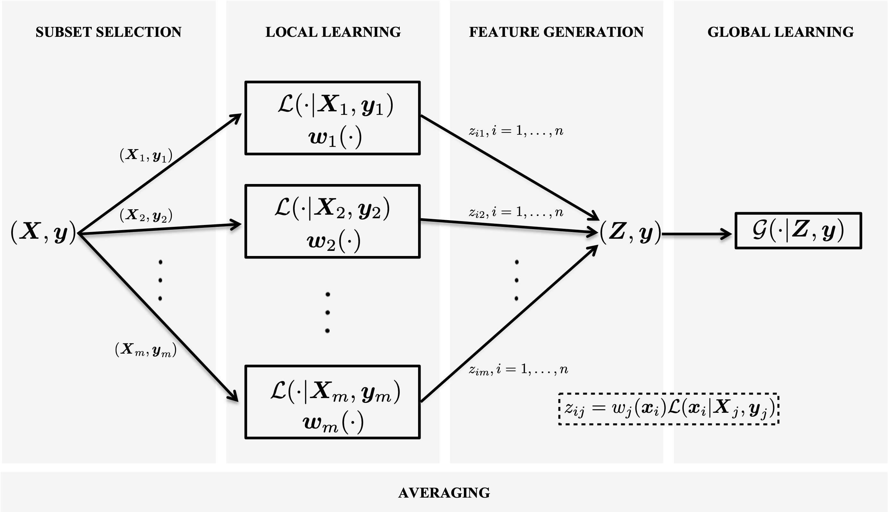

# Learning with Subset Stacking (LESS)

LESS is a supervised learning algorithm that is based on training many local estimators on subsets of a given dataset, and then passing their predictions to a global estimator. You can find the details about LESS in our [manuscript](https://arxiv.org/abs/2112.06251).

## Installation

-> `library(devtools)`

-> `install_github("bozercavdar/LESS_R")`
